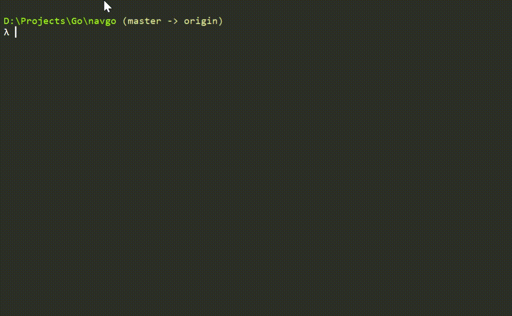

# navgo

A little util for viewing file structure in tree form

## Terminal output

## Keys

_Tree mode_

**h j k l** - navigation on the file tree vim style

**i** - close the folder

**d f** - scrolling up and down

**l** - if on file opens cat mode

_Cat mode_

**h i** - close the file

**j f** - scroll down

**d k** - scroll up
